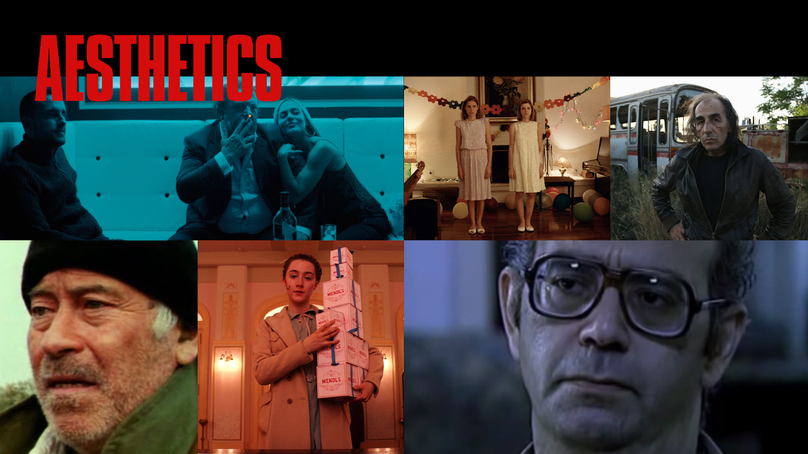
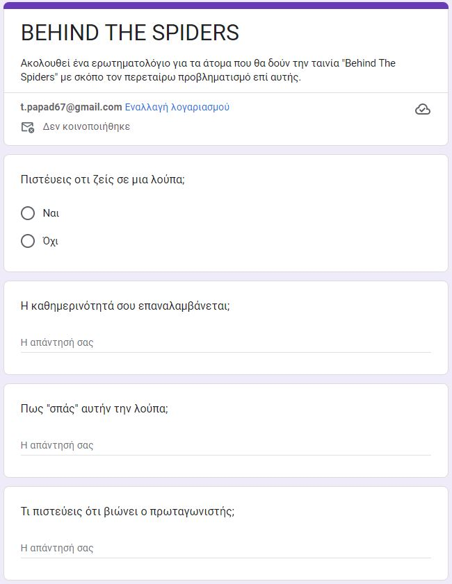
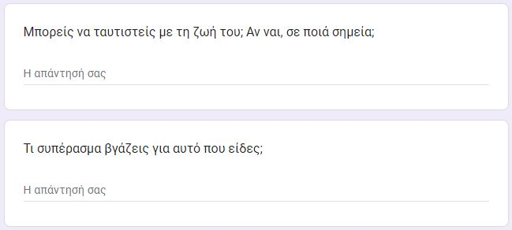
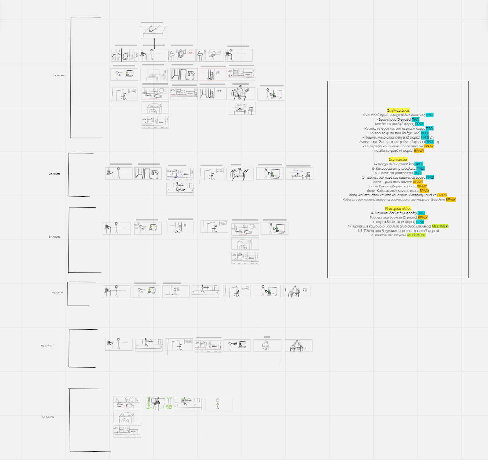
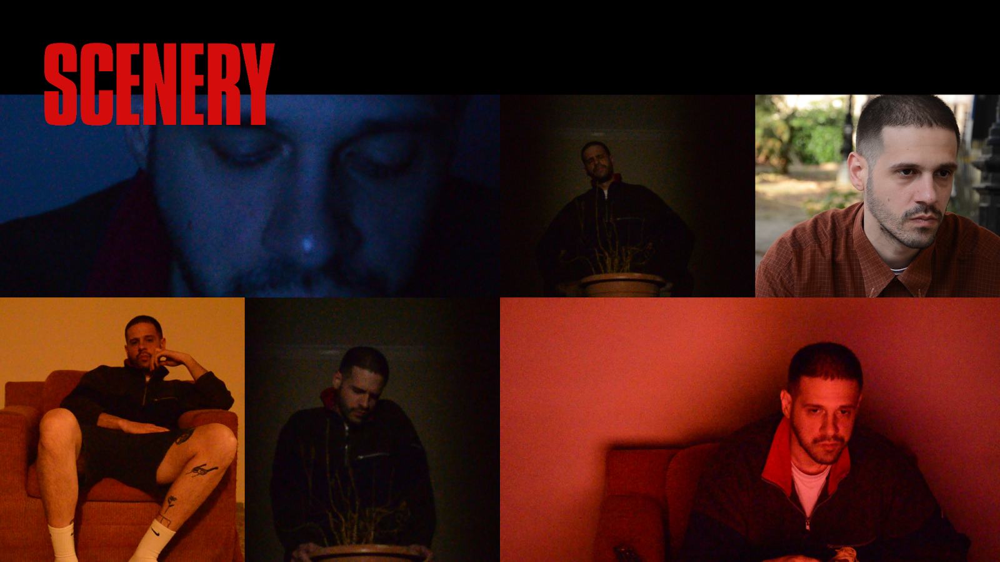
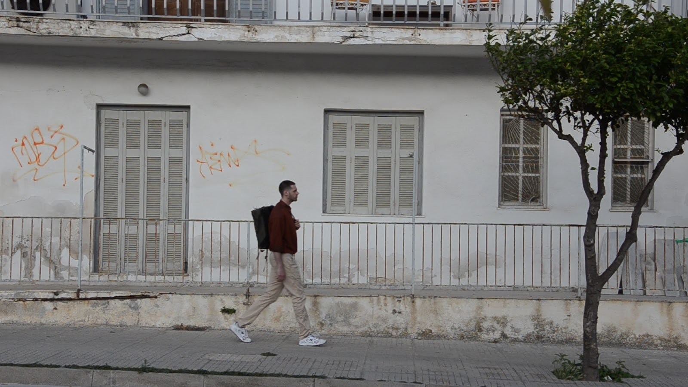
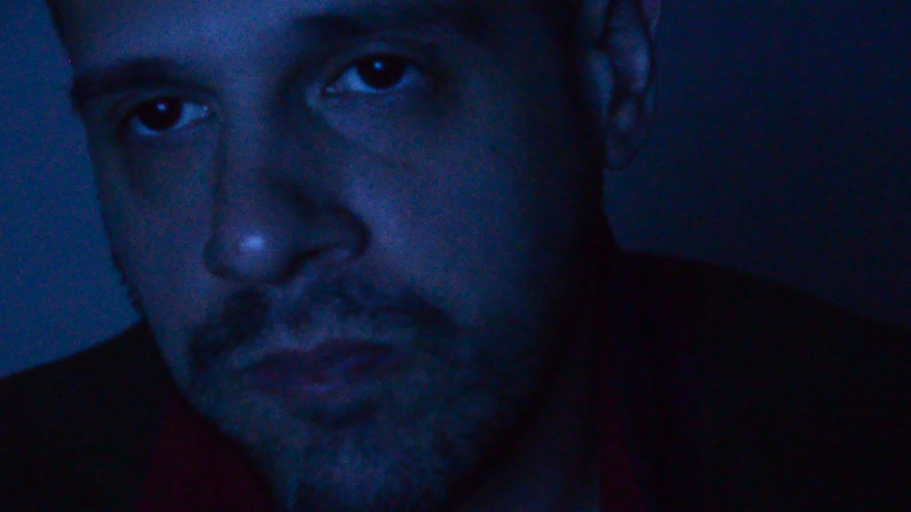
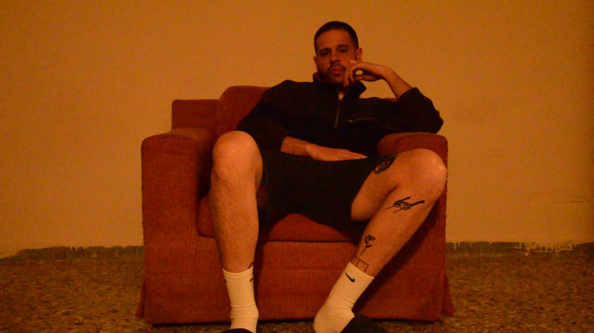
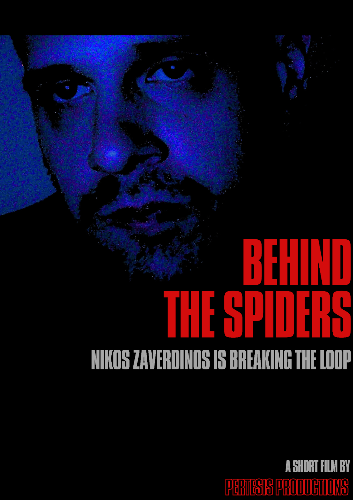

## Lesson: Digital Storytelling
## Design Document

### First and Last Name: Τίμων Ακίρα Πέλστερ, Νικηφόρος Μαυρίδης, Θεοδόσης Παπαδημητρίου, Φοίβος Βλάχος-Στρόμπλος, Ηλέκτρα Μαρία Ευθυμιάδη
### University Registration Number: dpsd17085, dpsd17067, dpsd19093, dpsd19037, dpsd18109
### GitHub Personal Profile: https://github.com/quarufus
### [Link to the movie](https://www.youtube.com/watch?v=TG4BJjcgo98)

---

# Behind the Spiders

## Περιεχόμενα

1. [Υπόθεση και στόχος](#Υπόθεση-και-στόχος)
2. [Αφήγηση](#Αφήγηση)
3. [Case](#Case)
4. [Worldbuilding - Κόσμος](#Worldbuilding---Κόσμος)
5. [Characters](#Characters)
6. [Ακολουθία Σκηνών](#Ακολουθία-Σκηνών)
7. [Τοποθεσίες κινηματογράφησης / επιλογήχώρων](#Τοποθεσίες-κινηματογράφησης-/-επιλογήχώρων)
8. [Aesthetics](#Aesthetics)
9. [Σκηνικά](#Σκηνικά)
   1. Props
   2. Ενδυμασία / Χτενίσματα
   3. Μουσική
   4. Αφήγηση
10. [Προϋπολογισμός παραγωγής και χρηματοδότηση](#Προϋπολογισμός-παραγωγής-και-χρηματοδότηση)
11. [Προβολή / Περιβάλλον αλληλεπίδρασης](#Προβολή-/-Περιβάλλον-αλληλεπίδρασης)
12. [Απευθυνόμενο κοινό& Αγορά](#Απευθυνόμενο-κοινό&-Αγορά)
   1. Ελκυστικότητα για το προτεινόμενο κοινό-στόχο 
13. [Εξοπλισμός](#ξοπλισμός)
14. [Χρονοδιάγραμμα](#Χρονοδιάγραμμα)
15. [Μέσα διανομής](#Μέσα-διανομής)
   1. Ταινία μικρούμήκους
   2. Escape Room Map
16. [Extensions](#Extensions)
17. [Casting](#Casting)
18. [Λήψεις](#Λήψεις)
19. [Σκηνές](#Σκηνές)
20. [Αφίσα](#Αφίσα)
21. [Evaluation](#Evaluation)
22. [Πηγές](#Πηγές)

## Υπόθεση και στόχος

Ένα άτομο βιώνει μια καθημερινή επαναλαμβανόμενη ρουτίνα, όπου παρεμβολές μέσα σε αυτήν, διαταρασουν τη ζωή του. Πως αντιδρά σε αυτές; Τελικά επηρεαζόμαστε από τις παρεμβολές της καθημερινότητας;

## Αφήγηση

Σκοπός της ταινίας είναι να αποδώσει ρεαλιστικά και παραστατικά η καθημερινότητα ενός ατόμου με μια σουρεαλιστική ματιά παίζοντας με την έννοια της λούπας.

## Case

Ο πρωταγωνιστής μας βιώνει μία καθημερινή λούπα στην οποία επαναλαμβάνει τα ίδια πράγματα καθημερινά. Παρακολουθούμε τον πρωταγωνιστή στην πρωινή του ρουτίνα, στον δρόμο για την δουλειά, στο δρόμο για το σπίτι του αλλά και τα βράδια του. Κατά την διάρκεια της κάθε λούπας ένα γεγονός έρχεται να τον διαταράξει παρατηρώντας έτσι την επιρροή που μπορεί να έχουν κάποια γεγονότα στην καθημερινότητά του.

## Worldbuilding - Κόσμος

Η ταινία διαδραματίζεται σε πραγματικό χρόνο ( Άνοιξη, 2023 ) σε αστικό περιβάλλον. Ο κόσμος είναι πραγματικός σε μια πρώτη ανάγνωση κάτι το οποίο διαφοροποιείται με την έννοια της ταινίας.

## Characters

Ο χαρακτήρας είναι 37 ετών και δουλεύει σε ένα γραφείο ώς φοροτεχνικός. Τα ενδιαφέροντά του είναι λίγα και κάπως αδιάφορα για τους άλλους. Είναι αντιήρωας στην ταινία, καθώς είναι ενίοτε μονόχνοτος και γενικότερα αδιάφορος για σημαντικά θέματα στη ζωή που φαντάζουν συνταρακτικά. Στον αντίποδα όμως, παρατηρούμε ότι επηρεάζεται απο φαινομενικά ασήμαντα γεγονότα, πράγμα που μας αποκαλύπτει ότι είναι σχεδόν σίγουρο ότι δεν έχει καταλάβει ούτε ο ίδιος ότι βρίσκεται μέσα σε αυτή τη λούπα.

## Ακολουθία Σκηνών

1η λούπα - εισαγωγική 

Ξυπνάει, πάει στη κουζίνα και ανάβει βραστήρα. Πάει τουαλέτα, κάνει την ανάγκη του και πλένεται. Επιστρέφει για να τελειώσει τη διαδικασία του καφέ. Πινει ορθιος καφε και παρατηρεί το φυτό του. Δε πινει ολοκληρο το καφε και ντυνεται με τα ετοιμα ρουχα που εχει ετοιμάσει της προηγουμενης. Ξεκρεμαει τσαντα (μπουφαν, καπελο, κλειδια) βαζει παπουτσια και βγαινει απο το σπιτι. (Βγαινει απο το κτιριο που μενει) περπαταει στο δρομο για να παει δουλειά. Μακρινα πλανα με τελευταίο να φτανει στο κτίριο της δουλειάς και να μπαινει μεσα. Με κάποιο τρόπο δείχνουμε ότι έχει περάσει ο χρόνος (ταιμλαπς, αλλαγή πλάνου, αλλαγή φωτισμού, ακολουθεί πλάνο που μπαίνει στο σπίτι,) και ακολουθεί τον ίδιο δρόμο για να επιστρέψει σπίτι.  Φτάνει σπίτι και μπαίνει μέσα. Τρώει από πλαστικό πιάτο σε πλάνο που δεν βλέπουμε το κεφάλι. Όσο τρώει βλέπει τηλεόραση. Αργότερα ποτίζει το φυτό του τελειώνει η λούπα.

2η λούπα - όπου πέφτει κάποιος

Βραστήρας. Πορτα. (λιγο πιο αργο)

Πηγαίνοντας στη δουλειά βλέπουμε κάποιον άνθρωπο να πέφτει. Πριν μπει στη δουλειά σταματάει να περπατάει για λίγο και φαίνεται να σκεφτεται με το χερι στην πορτα. Το απόγευμα κάθεται στο σαλόνι του, ποτίζει το βασιλικο, βλέπει ειδήσεις της φωτιάς στην Εύβοια. Δεν φαίνεται να πτοείται. Κλεινει η λουπα .

3η λούπα - όπου πέφτει ο καφές

Κατευθυνεται στην κουζινα, Βραστηρας. Τον βλέπουμε με τον καφέ στο χερι παρατηρεί το φυτό του.

Του πέφτει ο καφές το πρωί επειδή ακούγεται φασαρία, ενα ''μπαμ'' και τρομάζει. Ο καφές χύνεται πάνω του και τον λερώνει ολοκληρο. Τον βλέπουμε με καθαρα ρουχα στο σπιτι ετοιμο να φυγει. βλεπουμε να κλεινει η πορτα του σπιτιου.  πλανο που υπονοει οτι εχει παει και εχει επιστρεψει απο τη δουλεια (δρομος, εισοδος δουλειας). Ποτιζει βασιλικο και κλεινει η λουπα. 

4η λούπα - γρηγορη

Ξυπνάει. Καφές. Πόρτα. Περπάτημα. Δουλειά. Πότισμα. Κλασικη μουσικη.

5η λούπα - όπου καταστρέφεται ο  βασιλικός

Ξυπνάει. Καφές. Πόρτα. Περπάτημα. Δουλειά. Ανοιγει πορτα σπιτιου και συνειδητοποιεί ότι έχει μαραθεί ο βασιλικός και τα παθαίνει. Συμπεριφέρεται αμήχανα και άδεια. 

6η λούπα - resolution (τα ειπαμε τα συμφωνησαμε)

Πλάνα πιο αφηρημένα (ερκοντίσιον, πόλη, φύση) και τέλος βλέπουμε τον πρωταγωνιστή να κάθεται στο πάρκο και να σκέφτεται. 2ο πλάνο τον βλέπουμε να γυρνάει σπίτι με τον καινούριο βασιλικό στα χέρια.

## Τοποθεσίες κινηματογράφησης / επιλογήχώρων

Η ταινία γυρίστηκε στο νησί της Σύρου, χωρίς να χρησιμοποιούμε τα πιο χαρακτηριστικά σημεία της ερμούπολης αποδίδοντας έτσι μια πίο αστική εικόνα. Αναλυτικότερα χρησιμοποιήσαμε χώρους από δύο διαφορετικά σπίτια στην ερμούπολη και τραβήξαμε πλάνα από τον δρόμο της Λαλακιάς (Ανδ. Παπανδρέου), μία είσοδο ενός κτιρίου (γραφείο) αλλά και πλάνα από ένα πάρκο (Κορνιλάκη). Τα σπίτια τα οποία έγιναν τα γυρίσματα ήταν δύο διαφορετικά λόγο του ότι θέλαμε να έχουμε μια καλύτερη αίσθηση ενός χώρου. Ο δρόμος, επιλέχθηκε στοχευμένα για να αποδοθεί ένα πιο “σκληρό” αστικό τοπίο.

## Aesthetics

Η αισθητική που επηρεαστήκαμε είναι κυρίως σκηνοθέτες του ώμου ρεαλισμού (τουλάχιστον αποδοτικά). Σκηνοθέτες όπως ο Γιάννης Οικονομίδης, ο Γιώργος Λάνθιμος, ο Παντελής Βούλγαρης αλλά και ο Φωκίων Μπόγρης έπαιξαν καθοριστική επιρροή στην απόδοση της ταινίας. Κάποιες σκηνές επίσης επηρεάστηκαν απο την σχολαστικότητα της φωτογραφίας του Wes Anderson.
  

  
## Σκηνικά
Για σκηνικά χρησιμοποιήθηκαν μια κουζίνα, ένα μπάνιο, ένα σαλόνι και ο δρόμος.

### Props
Τα props ήταν: ένας βασιλικός σε γλάστρα, ένας καμμένος βασιλικός σε γλάστρα, μία τσάντα, ένας βραστήρας, φαγητό, τηλεόραση

### Ενδυμασία / Χτενίσματα
Ρούχα ύπνου για το σπίτι (μια βερμούδα, ένα φλυς), ρούχα δουλειάς(ένα πουκάμισο, ένα παντελόνι) 

### Μουσική
Mother Sky . Can

Dimitri Sostakovici . Stream Quartet No.8

### Αφήγηση
 Δεν έχει αφήγηση

## Προϋπολογισμός παραγωγής και χρηματοδότηση
- 7 ευρώ ο βασιλικός
- 20 ευρώ το ρούμι για τον πρωταγωνιστή

## Προβολή / Περιβάλλον αλληλεπίδρασης
- Στο youtube
- Σε κάποια αίθουσα προβολής

## Απευθυνόμενο κοινό & Αγορά
Για ενήλικες (περιέχει υβριστικό περιεχόμενο)

### Ελκυστικότητα για το προτεινόμενο κοινό-στόχο
Αναδεικνύει την καθημερινότητα, είναι κοντά στον κοινό άνθρωπο

## Εξοπλισμός
- Camera Nikon
- Τρίποδο 
- Κινητό
- Premiere Adobe
- Κάρτα SD
- Τηλεόραση

## Χρονοδιάγραμμα
1. Επιλογή θέματος
2. Δημιουργία σεναρίου
3. Χώροι λήψης
4. Κινηματογράφηση
5. Επεξεργασία (μοντάζ)
6. Μέσα διανομής

### Ταινία μικρού μήκους
Είναι ταινία μικρού μήκους που στόχο έχει να αναδείξει την επαναλαμβανόμενη        καθημερινότητα όλων και το ότι είναι αφοσιωμένοι μόνο στα δικά τους προβλήματα.

### Escape Room Map
Ερωτηματολόγιο με στόχο να εμβαθύνουν οι θεατές σε αυτό που είδαν και να δώσουν την δική τους ερμηνεία για το νόημα της ταινίας.

## Extensions
Το extension επιλέξαμε να είναι ένα ερωτηματολόγιο, το οποίο έχει σκοπό να κάνει τους θεατές που παρακολούθησαν την ταινία να σκεφτούν οι ίδιοι και να εμβαθύνουν πάνω στο νόημά της.

## Casting
Ο άνθρωπος που αποτελεί το casting είναι ένας και διαλέξαμε κάποιον που δεν είναι από τον χώρο του πανεπιστημίου, ώστε να μην θυμίζει τίποτα στους θεατές και να μην υπάρχει ταύτιση με την Σύρο

## Λήψεις
Κάναμε διάγραμμα ώστε να ξέρουμε ποιά σκηνή θα γυριστεί πού και με ποιά σειρά ώστε να προλάβουμε το φώς της μέρας ή της νύχτας ανάλογα με τις σκηνές που θέλαμε να γυριστούν.

## Σκηνές

## Αφίσα

## Evaluation

Χρειάστηκε να κάνουμε κάποιες αλλαγές ώστε να αποφύγουμε τον πολύ θόρυβο λόγω των εξωτερικών σκηνών. Οι βραδινές σκηνές μας έχουν σε κάποια σημεία noise που θα ήταν επιθυμητό να μην υπήρχαν.

## Πηγές

- BBC εικόνες 
- ΣΚΑΙ ειδήσεις για φωτιές στην Εύβοια
- [https://www.youtube.com/watch?v=-0nKJoZY64A&ab](https://www.youtube.com/watch?v=-0nKJoZY64A&ab_channel=olla-vogala)
- [https://www.youtube.com/watch?v=EVi-UTF9PL4&ab](https://www.youtube.com/watch?v=EVi-UTF9PL4&ab_channel=MichalisMatthaiou)
- [https://www.youtube.com/watch?v=skD7r0yWOG4&ab](https://www.youtube.com/watch?v=skD7r0yWOG4&ab_channel=AdultSwim)
